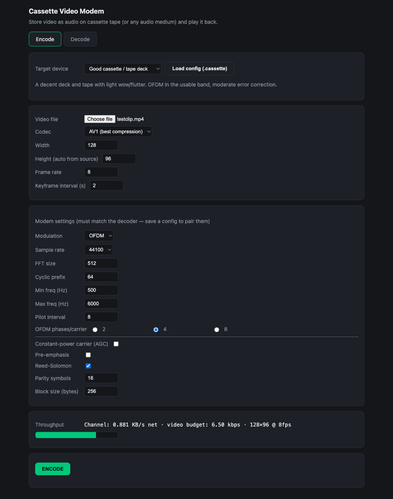
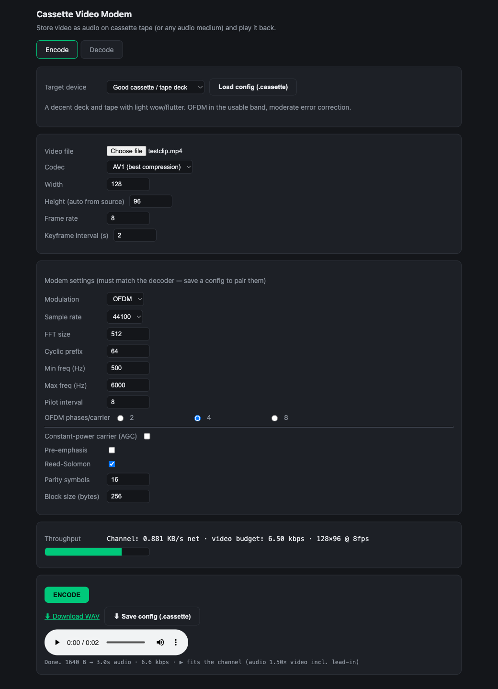
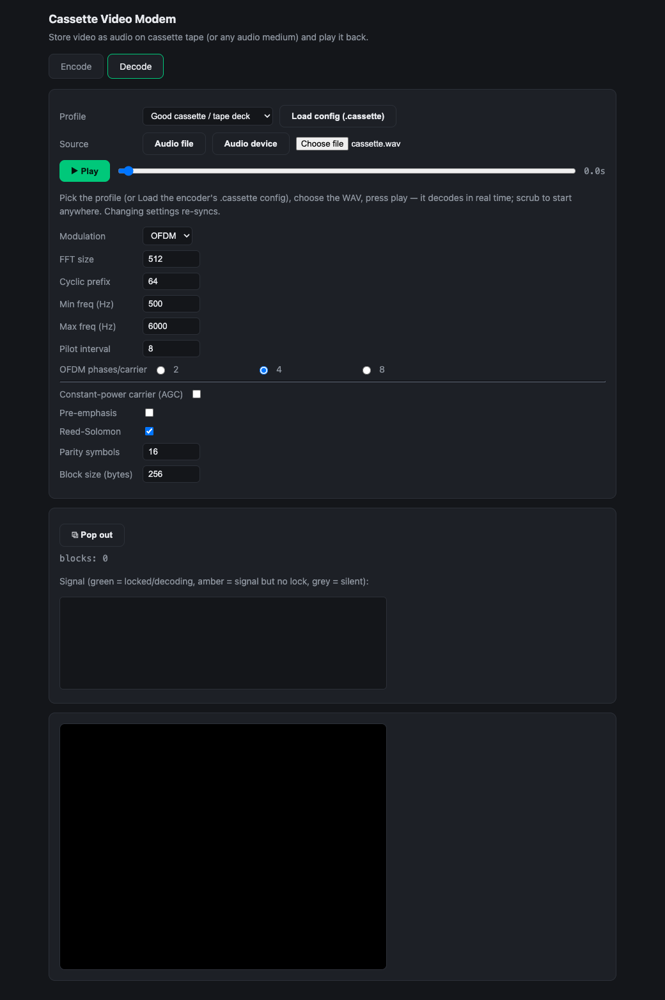
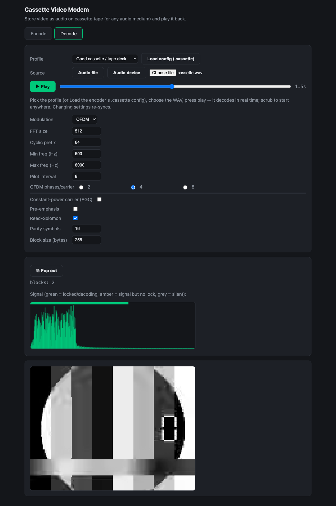

# Visual manual — what works, step by step

A walkthrough of the web app's two flows, with screenshots captured from the
**live site** (https://arthurbthiele.github.io/cassette-video-modem/). Every shot
below is a real run, not a mockup — this is the app doing exactly what the captions
say. Use Chrome or Edge (the app uses WebCodecs).

**Just want to see it work?** The decode tab has a **▶ Try a sample tape** button — it
loads a bundled, pre-encoded clip and plays it immediately, no files needed. The encode
tab has a **Try a sample** button that loads a sample video ready to encode.

The loop is symmetric: **Encode** turns a video file into a WAV of modem audio you
can record to tape; **Decode** takes that audio back (from a file or live line-in)
and plays the video as it decodes. The one rule that matters: **the decoder's modem
settings must match the encoder's.** Saving a `.cassette` config on the encode side
and loading it on the decode side guarantees that — or just pick the same profile on
both sides.

---

## 1. Encode — set up a video

Pick a **Target device** profile (here *Good cassette / tape deck*), choose a video
file, and the modem settings below fill in to match. The profile is the easy path —
it sets modulation, band, error-correction and the rest sensibly for that medium. You
can still override anything by hand.

- **Target device** — the channel you're recording to. Each profile trades speed for
  robustness; the description under it tells you what it assumes.
- **Width / Height** — the video resolution. Height auto-fills from the source's
  aspect ratio. Smaller = more frames-per-second fit in the channel.
- **Throughput bar** (bottom) — live budget. It shows the channel's net byte rate and
  the video bitrate it's fitting into, so you can see *before* encoding whether your
  settings fit.

## 2. Encode — done

Press **ENCODE**. When it finishes you get:

- **Download WAV** — the modem audio. This is what you record onto the tape.
- **Save config (.cassette)** — the exact settings, to hand to the decoder so it
  matches. Pair the WAV with its config and decoding is foolproof.
- An inline **audio player** to hear the modem tones, and a one-line summary:
  `Done. 1640 B → 3.0s audio · 6.6 kbps · ▶ fits the channel`. *Fits the channel*
  means the video bitrate sits inside the medium's budget — it will decode cleanly.

## 3. Decode — load the audio

Switch to the **Decode** tab. Either **Load config (.cassette)** (sets every setting
to match the encoder) or pick the same profile. Choose the WAV via **Audio file**, or
switch the source to **Audio device** to decode live from line-in (a tape playing in
real time).

The transport appears: a **Play** button and a **scrub bar**. Nothing decodes until
you play — and you can scrub to start anywhere, which is what makes a tape that stops
mid-stream just pause the picture. `blocks: 0` and the black screen are the
expected idle state before playback.

## 4. Decode — playing

Press **Play**. The audio decodes **in real time** and the picture builds frame by
frame. Two things confirm it's working:

- **The Signal meter goes green** — green means *locked and decoding*. (Amber would
  mean "there's a signal but I can't lock onto it" — usually a settings mismatch;
  grey means silence.) The spectrum shows the modem's energy sitting in the band you
  configured.
- **`blocks:` climbs** as data blocks are recovered, and the **video appears** below.

Scrub backwards or forwards to re-sync from any point. Stopping the source (or the
tape) simply pauses the picture — exactly the brief.

---

### What this proves

This is a full round trip on the live site: a real video → modem audio (WAV) →
decoded back to watchable video, entirely in the browser, with the *Good cassette*
profile (OFDM, Reed-Solomon on). The decode happens in real time off the audio
stream, and the live meter shows a clean lock. Pick a more robust profile (more error
correction, narrower band) for worse tape; a faster one (e.g. *Clean line / CD*) for
better media.

> Captured at 1040×920 on the live site. To regenerate after a UI change, repeat the
> four steps above and replace the PNGs in this folder.
